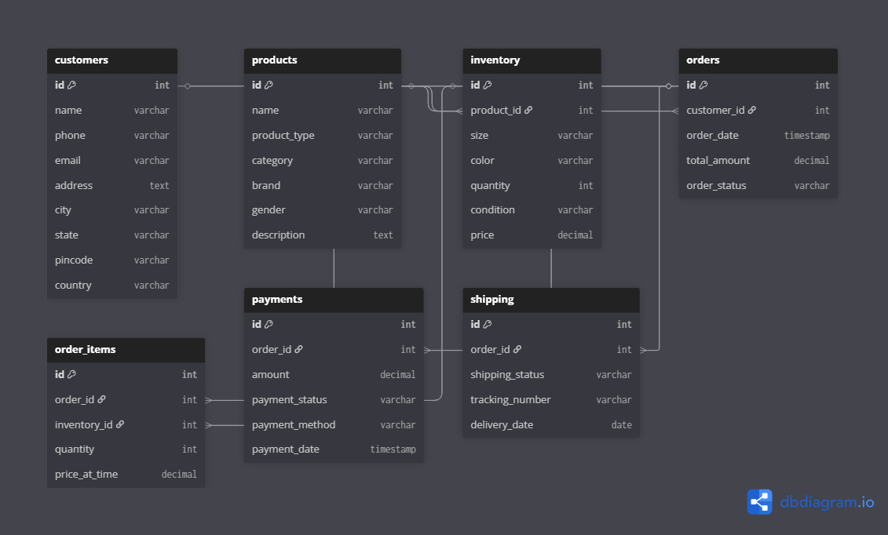

# 📦 Day 1: Instagram Thrift Store Database Design

## 🧠 Problem

A small creator sells thrifted and handmade fashion items through Instagram DMs and WhatsApp.
As the business grows, they need a structured system to manage products, inventory, orders, payments, and shipping.

---

## 🎯 Objective

Design a scalable and normalized database system that can:

* Manage products (thrifted & handmade)
* Track inventory with variations (size, color, etc.)
* Handle customer orders
* Store payment and shipping details

---

## 🔥 Key Challenges

* Thrift items are unique (only one piece available)
* Handmade items can have multiple quantities
* No traditional e-commerce system (orders via DM/WhatsApp)
* Need to track product variations like size and color

---

## 💡 Solution Approach

* **Separated Product & Inventory**
  Product stores general info, while inventory handles variations like size, color, quantity, and price.

* **Used Order_Items as Junction Table**
  Handles many-to-many relationship between orders and products.

* **Inventory-based Ordering**
  Orders reference inventory instead of products to track exact item (size/color).

* **Payment & Shipping Separation**
  Payment and shipping details are stored in separate tables for better scalability.

---

## 🧱 Entities

* Customers
* Products
* Inventory
* Orders
* Order_Items
* Payments
* Shipping

---

## 🔗 Relationships (Overview)

* One customer can place multiple orders
* One order can contain multiple items
* Each order item is linked to a specific inventory unit
* Each product can have multiple inventory variations

---

## 📊 ER Diagram

---

## 🚀 Learning

* Understood real-world database design concepts
* Learned how to handle unique vs multi-stock products
* Practiced normalization and relationship design
* Improved thinking in terms of scalable systems

---

## ✅ Status

Day 1 completed 🚀
