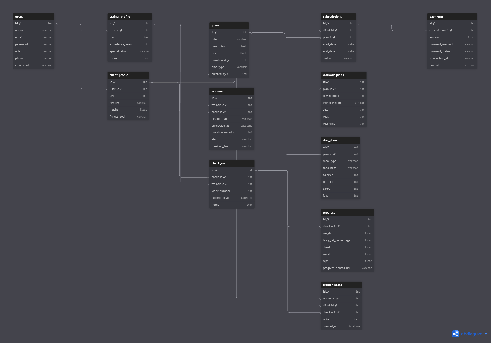

# 🏋️‍♂️ Fitness Influencer Coaching Platform – Database Design

##LINK:
https://dbdiagram.io/d/69d73cf68089629684536602

## 📌 Overview

This project focuses on designing a scalable and practical **database system** for a fitness influencer’s online coaching business.

Initially, coaching happens via Instagram DMs and video calls, but as the business grows, a structured platform is needed to manage:

* Clients and Trainers
* Coaching Plans & Subscriptions
* Sessions & Consultations
* Progress Tracking & Check-ins
* Payments & Transactions

This ER design models a **real-world online coaching ecosystem** instead of a traditional gym system.

---

## 🎯 Problem Statement

Design an ER diagram that can answer key business questions such as:

* Who are the trainers and clients?
* Which client purchased which plan?
* How are subscriptions managed over time?
* Are sessions and consultations scheduled?
* How is client progress tracked?
* How are payments handled?

---

## 🧠 Key Design Decisions

### 1. 👥 User Abstraction

A single `USERS` table is used for authentication with role-based separation:

* Trainer
* Client

Additional details are stored in:

* `TRAINER_PROFILE`
* `CLIENT_PROFILE`

---

### 2. 📦 Subscription-Based Model

Instead of directly linking clients to plans:

* A `SUBSCRIPTIONS` table is introduced

This allows:

* Multiple plan purchases by a client over time
* Tracking start and end dates
* Managing plan lifecycle (active, expired, cancelled)

---

### 3. 🏋️ Plans & Programs

* Trainers create multiple plans
* Each plan can be subscribed to by many clients
* Plans can represent:

  * Workout programs
  * Diet plans
  * Combo plans

---

### 4. 📅 Sessions vs Check-ins (Important Distinction)

* `SESSIONS` → Live interactions (consultation / training)
* `CHECK_INS` → Weekly progress updates submitted by clients

This separation ensures clarity and scalability.

---

### 5. 📊 Progress Tracking

Progress data is not stored directly in user tables.

Instead:

* Each check-in is linked to a `PROGRESS` record
* Includes:

  * Weight
  * Body measurements
  * Progress photos

---

### 6. 💬 Trainer Feedback System

* `TRAINER_NOTES` stores feedback and guidance
* Linked to:

  * Trainer
  * Client
  * Specific Check-in

---

### 7. 💳 Payment Handling

* Payments are linked to `SUBSCRIPTIONS`
* Supports:

  * Transaction tracking
  * Payment status
  * Multiple payment attempts

---

### 8. 🥗 Advanced Plan Breakdown (Optional but Scalable)

To support detailed coaching:

* `WORKOUT_PLANS` → Daily exercises
* `DIET_PLANS` → Meal-based nutrition

---

## 🧩 Entities Included

* Users (Trainer & Client)
* Trainer Profile
* Client Profile
* Plans
* Subscriptions
* Payments
* Sessions
* Check-ins
* Progress
* Trainer Notes
* Workout Plans
* Diet Plans

---

## 🔗 Relationships & Cardinality

* One Trainer → Many Clients
* One Client → Many Subscriptions
* One Plan → Many Subscriptions
* One Subscription → Many Payments
* One Client → Many Check-ins
* One Check-in → One Progress record
* One Trainer → Many Sessions

---

## ⚙️ Design Principles Used

* Normalization (avoiding redundancy)
* Separation of concerns
* Real-world modeling
* Scalable architecture
* Clear PK & FK relationships

---

## 📊 ER Diagram

---

## 🚀 Conclusion

This database design provides a **robust and scalable foundation** for an online fitness coaching platform.

It effectively handles:

* User management
* Subscription lifecycle
* Coaching interactions
* Progress tracking
* Payments

and is flexible enough to support future feature expansion.

---

## 💡 Author

**Alok Kumar Singh**
B.Tech CSE 1st Year | Web Dev Cohort 2026
Building in public 🚀
