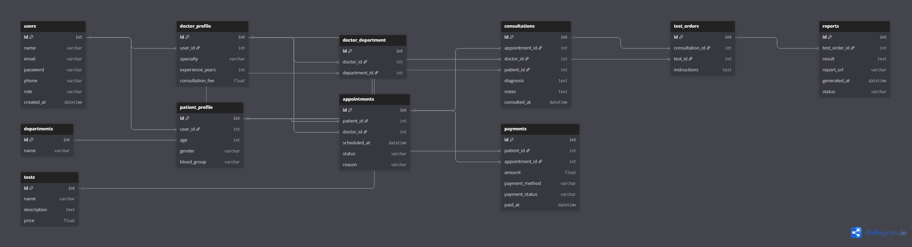

# 🏥 Clinic Appointment & Diagnostics Platform – Database Design

## 📌 Overview

This project focuses on designing a scalable and practical **database system** for a modern clinic.

The system handles the complete workflow of:

* Patient registration
* Doctor management
* Appointment booking
* Consultation (actual visit)
* Diagnostic test prescriptions
* Report generation
* Payment tracking

---
LINK:
https://dbdiagram.io/d/69d747e20f7c9ef2c0b3ddbd
---

The goal is to model a **real-world clinic flow** in a clean and normalized database design.

---

## 🎯 Problem Statement

Design an ER diagram that can answer key questions like:

* Who are the doctors and what are their specialties?
* Which patient booked which appointment?
* Did the appointment result in a consultation?
* What diagnosis was made?
* Were any diagnostic tests prescribed?
* What reports were generated?
* How are payments managed?

---

## 🧠 Key Design Decisions

### 1. 👥 User Abstraction

A central `USERS` table is used for authentication with roles:

* Patient
* Doctor
* Admin

Role-specific data is separated into:

* `DOCTOR_PROFILE`
* `PATIENT_PROFILE`

---

### 2. 📅 Appointment vs Consultation (Critical Concept 🔥)

* `APPOINTMENTS` → Booking (scheduled interaction)
* `CONSULTATIONS` → Actual visit with diagnosis

👉 Not every appointment results in a consultation (e.g., no-show or cancellation)

---

### 3. 🩺 Consultation as Core Entity

The `CONSULTATIONS` table acts as the **central medical interaction layer**:

* Links doctor and patient
* Stores diagnosis and notes
* Acts as the source for test prescriptions

---

### 4. 🧪 Diagnostic Test Flow

* `TESTS` → Master list of available tests
* `TEST_ORDERS` → Tests prescribed during consultation

👉 This allows:

* Multiple tests per consultation
* Reuse of test definitions

---

### 5. 📊 Reports Management

* Reports are linked to `TEST_ORDERS`, not directly to patients
* Ensures:

  * Accurate tracking of each test instance
  * Support for repeated tests across visits

---

### 6. 🏢 Department Modeling (Advanced Design)

* `DEPARTMENTS` table added for scalability
* `DOCTOR_DEPARTMENT` handles many-to-many relation

👉 A doctor can belong to multiple departments

---

### 7. 💳 Payment Handling

* Payments are linked to `APPOINTMENTS`
* Also linked to patients for history tracking

---

## 🧩 Entities Included

* Users
* Doctor Profile
* Patient Profile
* Departments
* Doctor-Department Mapping
* Appointments
* Consultations
* Tests (Master)
* Test Orders
* Reports
* Payments

---

## 🔗 Relationships & Cardinality

* One Doctor → Many Appointments
* One Patient → Many Appointments
* One Appointment → One or Zero Consultation
* One Consultation → Many Test Orders
* One Test → Many Test Orders
* One Test Order → One Report
* One Patient → Many Payments

---

## ⚙️ Design Principles Used

* Database normalization
* Separation of concerns
* Real-world workflow modeling
* Scalable architecture
* Clear PK & FK relationships

---

## 📁 Submission Details

This repository contains:

## 📊 ER Diagram

---

## 🚀 Conclusion

This database design provides a **clean and scalable structure** for managing clinic operations.

It accurately models:

* Appointment lifecycle
* Consultation workflow
* Diagnostic process
* Reporting system
* Payment tracking

and is flexible enough for future expansion.

---

## 💡 Author

**Alok Kumar Singh**
B.Tech CSE 1st Year | Web Dev Cohort 2026
Building in public 🚀
